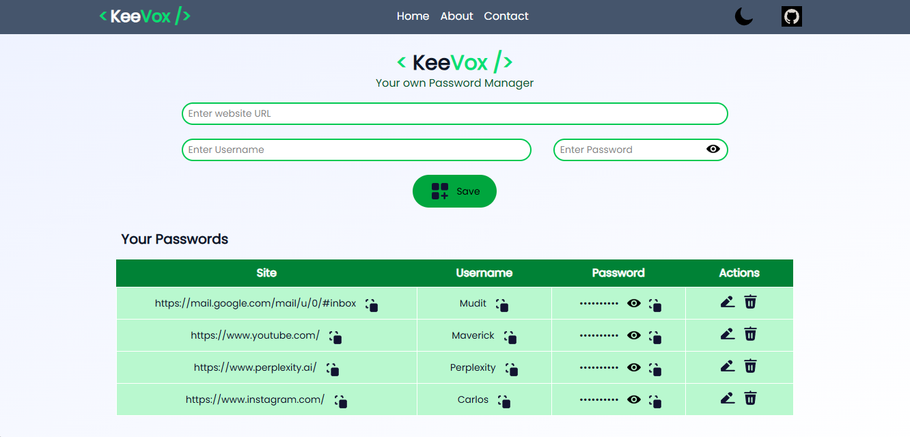
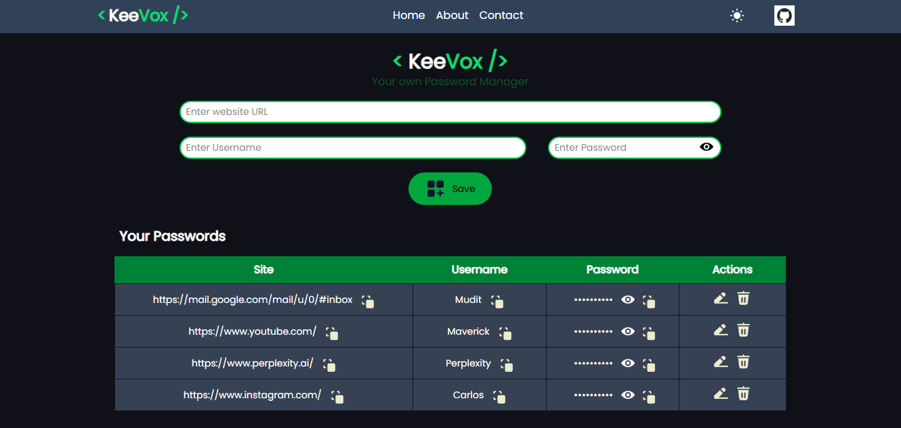
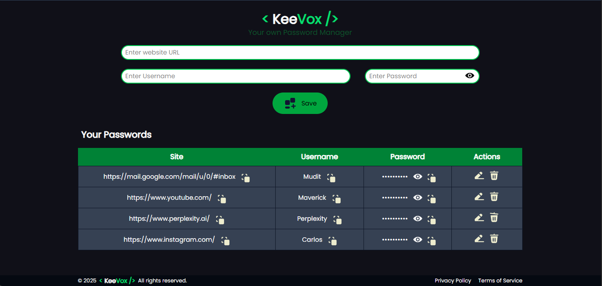

# 🔐 KeeVox - Your Personal Password Manager

KeeVox is a secure, responsive, and modern password manager built with **React**, **Node.js**, **Express.js**, and **MongoDB**. It allows you to store, manage, and retrieve your passwords effortlessly, with support for dark mode, editing, and clipboard copy functionality.

---

## 📸 Screenshots

Light Mode  


Dark Mode  


Additional View  


---

## 🚀 Features

- 🔐 Add, Edit, and Delete passwords
- 👁️ Toggle password visibility
- 📋 Copy to clipboard for quick use
- ☁️ Syncs with MongoDB backend
- 🌗 Light/Dark mode support
- 💾 Offline persistence using `localStorage`
- 🧩 Fully responsive UI (desktop & mobile)

---

## 🛠️ Tech Stack

**Frontend**:
- React (with Hooks)
- Tailwind CSS
- React Toastify
- Lordicon animations

**Backend**:
- Node.js
- Express.js
- MongoDB (with Mongoose)
- UUID for unique password entries

---

## 📬 API Endpoints

- `GET /` – Fetch all passwords  
- `POST /` – Add a new password entry  
- `DELETE /` – Delete a password entry by ID  

---

## 🔧 Installation

### ⚙️ Prerequisites

- Node.js & npm installed
- MongoDB running (locally or via [MongoDB Atlas](https://www.mongodb.com/cloud/atlas))

---

### ▶️ Setup Instructions

```bash
git clone https://github.com/Mudit-750/keevox.git
cd keevox/frontend
npm install
npm run dev

# Open a new terminal for the backend
cd backend
npm install
node server.js

```

<br>

--- 

<br>

> **ℹ️ Note:**  
> KeeVox will run and function even if the backend server is not started.  
> - **If the backend server is running:** Passwords are securely synced and stored in your MongoDB database.
> - **If the backend server is *not* running:** Passwords will be saved locally in your browser using `localStorage`.  
> This allows you to use KeeVox offline or without a backend, but your data will only be available on the device and browser where it was entered.


